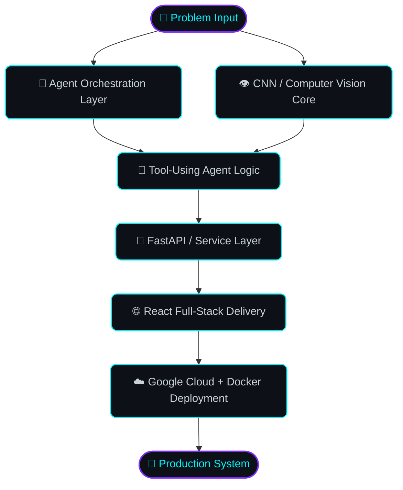

 

&nbsp;
&nbsp;
&nbsp;

 

<!-- ============================================================ -->
<!-- SECTION 01 — BLUEPRINT OVERVIEW                              -->
<!-- ============================================================ -->

### 📐 &nbsp; BLUEPRINT&nbsp;01 &nbsp;/&nbsp; PROFILE&nbsp;OVERVIEW

SCALE 1:1 &nbsp;·&nbsp; DRAWN BY DarkKnight27x &nbsp;·&nbsp; SHEET A-001

<table width="100%">
<tr><td>

| SPEC | DETAIL |
|:--|:--|
| **Codename** | `DarkKnight27x` |
| **Discipline** | Full-Stack AI Engineering · Agentic Systems · Computer Vision |
| **Site Location** | VIT Chennai &nbsp;/&nbsp; Mumbai, India |
| **Load-Bearing Skills** | AI Agents · Convolutional Neural Networks · Full-Stack Delivery |
| **Alter Ego** | 🦇 Gotham's after-hours committer |
| **Currently Constructing** | Production-grade agentic AI systems + CV pipelines |
| **Design Philosophy** | *Ship structures that think — not just render* |

</td></tr>
</table>

 

<!-- ============================================================ -->
<!-- SECTION 02 — SYSTEM ARCHITECTURE                             -->
<!-- ============================================================ -->

### 🏗️ &nbsp; BLUEPRINT&nbsp;02 &nbsp;/&nbsp; SYSTEM ARCHITECTURE

HOW I DESIGN INTELLIGENT SYSTEMS, END TO END

Every project below is a load-bearing instance of this blueprint.

 

<!-- ============================================================ -->
<!-- SECTION 03 — MATERIALS / TECH ARSENAL                        -->
<!-- ============================================================ -->

### 🧩 &nbsp; BLUEPRINT&nbsp;03 &nbsp;/&nbsp; STRUCTURAL MATERIALS

APPROVED TECH STACK FOR LOAD-BEARING WORK

<table width="100%">
<tr>
<td width="25%" valign="top" align="center">

**🔩 Foundation**
  
 
 
 
 

</td>
<td width="25%" valign="top" align="center">

**🧠 Intelligence Layer**
  
 
 
 
 

</td>
<td width="25%" valign="top" align="center">

**🌐 Facade &nbsp;/&nbsp; Interface**
  
 
 
 
 

</td>
<td width="25%" valign="top" align="center">

**☁️ Infrastructure**
  
 
 
 

</td>
</tr>
</table>

 

<!-- ============================================================ -->
<!-- SECTION 04 — LIVE TELEMETRY                                  -->
<!-- ============================================================ -->

### 📡 &nbsp; BLUEPRINT&nbsp;04 &nbsp;/&nbsp; LIVE TELEMETRY

REAL-TIME STRUCTURAL METRICS, AUTO-SURVEYED BY GITHUB

 

<!-- ============================================================ -->
<!-- SECTION 05 — PROJECT BLUEPRINTS                              -->
<!-- ============================================================ -->

### 🗂️ &nbsp; BLUEPRINT&nbsp;05 &nbsp;/&nbsp; CONSTRUCTED WORKS

SELECTED STRUCTURES, FULLY PERMITTED &amp; DEPLOYED

<table width="100%">
<tr>
<td width="50%" valign="top">

<h4>🎧 &nbsp;MoodMuse</h4>
<strong>DWG NO. 001</strong> &nbsp;·&nbsp; AI Playlist Generator, Spotify-Integrated

A mood-aware recommendation engine — a quiz-driven preference vector feeds a multi-objective ranking system layered over live Spotify data to generate genuinely personalized playlists.

</td>
<td width="50%" valign="top">

<h4>🛡️ &nbsp;SJ</h4>
<strong>DWG NO. 002</strong> &nbsp;·&nbsp; Production-Grade AI Agent

An autonomous, tool-using AI agent engineered for real-world reliability from the foundation up — built to production standards, not prototyped and left there.

</td>
</tr>
<tr>
<td width="50%" valign="top">

<h4>💬 &nbsp;GDG-CHATBOT</h4>
<strong>DWG NO. 003</strong> &nbsp;·&nbsp; GenAI Financial Assistant

Conversational assistant delivering real-time financial insights through a GenAI-driven interface.

</td>
<td width="50%" valign="top">

<h4>🖥️ &nbsp;OS-Simulator</h4>
<strong>DWG NO. 004</strong> &nbsp;·&nbsp; Systems Visualizer

An interactive visualizer that turns core Operating System concepts into something you can actually see move.

</td>
</tr>
</table>

 

<!-- ============================================================ -->
<!-- SECTION 06 — TRANSMISSION LINES                              -->
<!-- ============================================================ -->

### 📶 &nbsp; BLUEPRINT&nbsp;06 &nbsp;/&nbsp; TRANSMISSION LINES

OPEN CHANNELS FOR COLLABORATION

  

<em>"It's not who I am underneath, but what I deploy that defines me."</em> 🦇

